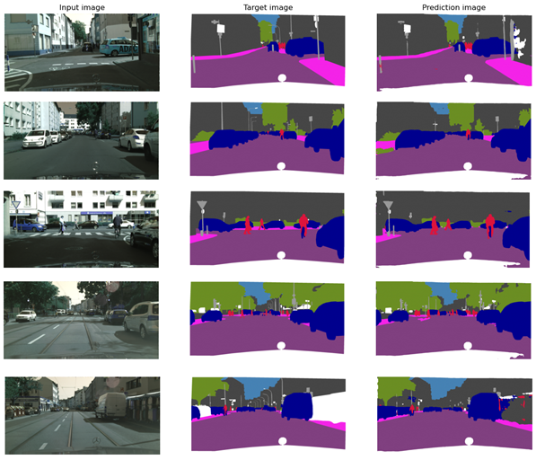
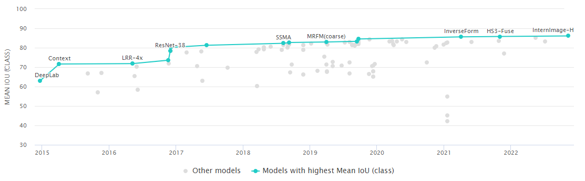

# Test-NN
Segmentare semantică pe setul de date Cityscapes 

<big>Definirea problemei</big> 

Tema proiectului se concentrează pe dezvoltarea unei abordări avansate pentru a identifica și determina elementele distinctive prezente într-o imagine, care sunt specifice unui mediu urban, în scopul utilizării lor de către vehiculele autonome. Scopul final al acestui proiect este de a permite mașinilor autonome să obțină o înțelegere completă a mediului urban în care operează, recunoscând și interpretând corect obiectele, semnele de circulație, marcajele rutiere, pietonii, bicicliștii și alte entități prezente pe străzi și în jurul lor. 

<big>Setul de date</big> 

Setul de date utilizat este Cityscapes, el este un set de date larg și divers care este utilizat în cercetarea în domeniul viziunii artificiale și al învățării automate. Acesta a fost creat pentru a facilita dezvoltarea și evaluarea algoritmilor de înțelegere a scenei urbane, cum ar fi segmentarea semantică, detectarea obiectelor și recunoașterea străzilor. 

Setul de date Cityscapes conține imagini detaliate și etichetate manual din 50 de orașe europene diferite. Imaginile sunt capturate în condiții variate de iluminare și conțin o varietate de scene urbane, cum ar fi intersecții, străzi cu sens unic, zone rezidențiale și artere principale. Fiecare imagine este însoțită de etichete de referință care identifică și clasifică diferitele elemente din scenă, cum ar fi pietoni, bicicliști, mașini, semafoare, marcaje rutiere și clădiri. 

Etichetele în Cityscapes sunt foarte detaliate și oferă informații despre clasele obiectelor, precum și segmentele semantice ale diferitelor regiuni din imagine. În proiect se folosesc numai etichetele pentru segmentarea semantică . 

<big>Arhitectura</big> 

DeepLabv3 cu ResNet-101 este o arhitectură avansată de rețea neurală convoluțională utilizată pentru segmentarea semantică în domeniul viziunii artificiale. Această arhitectură combină două componente cheie: DeepLabv3, care se concentrează pe captarea informațiilor contextuale, și ResNet-101, o rețea neurală convoluțională pre-antrenată ce servește ca extractor de caracteristici. 

Arhitectura Deeplabv3 se bazează pe metoda de învățare profundă a învățării supervizată, în care un model este antrenat să asocieze fiecărui pixel dintr-o imagine o etichetă semantică specifică. Aceasta este realizată prin utilizarea unui encoder-decoder și a unor straturi convoluționale pentru a captura informații la diferite niveluri de rezoluție. 

Encoder-ul utilizează o variantă modificată a rețelei ResNet-101 ca strat de bază pentru a extrage caracteristici de înaltă calitate din imagine. ResNet-101 constă într-o serie de blocuri de reziduali, care permit învățarea mai eficientă și previn deteriorarea performanței în timpul antrenării în adâncime. Această rețea pre-antrenată pe un set de date mare, cum ar fi ImageNet, a dobândit capacitatea de a recunoaște obiecte și caracteristici de bază din imagini. 

După extragerea caracteristicilor, arhitectura Deeplabv3 integrează un strat atrous pentru a crește câmpul receptiv al rețelei și pentru a capta informații de context într-un mod eficient. Aceasta permite modelului să aibă o mai bună percepție a obiectelor și a relațiilor dintre ele în imagine. 

Decoderul utilizează o combinație de upsample-uri și convoluții pentru a restabili rezoluția caracteristicilor și pentru a genera hărți de segmentare semantică de dimensiuni corespunzătoare. De asemenea, este utilizată o tehnică numită "skip connection" pentru a adăuga informații detaliate de la etapele mai timpurii ale rețelei, astfel încât să se păstreze caracteristicile de înaltă rezoluție. 

Pentru realizarea proiectului modelul va avea 9 clase de ieșire, pentru antrenare nu redimensionăm imaginea și se realizează un crop de 500 pixeli, din cauza spațiului insuficient , și pentru testare trecem imaginea întreagă prin el. Funcția de optimizare este Adam și funcția de Loss este DiceLoss-ul . 

<big>Performanțe</big> 

Pentru evaluarea modelului se va folosi funcția IoU (intersection over union) care măsoară gradul de suprapunere între o predicție și o etichetă de referință.  Rezultatele finale folosind metrica IoU sunt prezentate în Tab.1. Media IoU pe toate clasele este de 71.27%. 

Tab.1 
| Clasa | Void   | Șosea  | Clădire | Semne de circulație | Vegetație | Cer    | Persoană | Vehicul | Trotuar |
|-------|--------|--------|---------|---------------------|-----------|--------|----------|---------|---------|
| IoU   | 65.26% | 90.77% | 80%     | 49.93%              | 84.14%    | 75.49% | 53.87%   | 78.54%  | 63.44%  |

Vizualizarea rezultatelor este prezentată în Fig.1 .

Fig.1 Vizualizarea Rezultatelor folosind modelul antrenat   

Pe website-ul paperswithcode cele mai performante modele au un IoU mediu a în jur de 85%, prezentat în Fig.2, și pe același model ales, DeepLabv3 cu ResNet-101, el este de 81%. Un motiv posibil pentru care nu este la fel de performant poate să fie spațiul insuficient de memorie, de exemplu modelul care foloseste DeepLabv3 cu ResNet-101 are un batch size de 32, pe când modelul realizat are 3, și mărimea de crop a imagini este de 769, și modelul realizat o are de 500. 

 

Fig.2 Rezultate pe paperswithcode pe setul de date Cityscapes   
